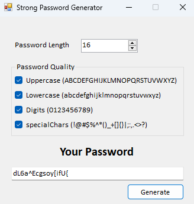

# Güçlü Şifre Üretici

Bu proje, güçlü ve güvenli şifreler oluşturmanıza yardımcı olan bir Windows masaüstü uygulamasıdır. C# kullanılarak geliştirilmiş bu uygulama, şifrenizin en az bir büyük harf, bir küçük harf, bir rakam ve bir özel karakter içermesini sağlar. Ayrıca, kullanıcıya hangi karakter türlerini dahil etmek istediğini seçme imkanı sunar.

## Özellikler

- Dinamik karakter kümesi: Büyük harf, küçük harf, rakam ve özel karakterleri seçebilirsiniz.
- Minimum şifre uzunluğunu belirleyebilirsiniz.
- Şifrelerinizi güçlü ve rastgele oluşturur.
- Kullanıcı dostu arayüz ile kolay kullanım.

## Ekran Görüntüleri

 <!-- Ekran görüntüsünü projenize eklemeyi unutmayın -->

## Kurulum ve Kullanım

1. **Projeyi İndirin:**
   GitHub'dan projeyi klonlayın veya ZIP dosyasını indirip çıkarın.
   ```bash
   git clone https://github.com/erkanhacioglu/StrongPasswordGenerator.git

2. **Visual Studio ile Açın:**
Projeyi Visual Studio'da açın.

3. **Projeyi Çalıştırın:**
Visual Studio'da projeyi çalıştırarak uygulamayı başlatın.

4. **Şifre Oluşturun:**
Uygulama açıldığında, karakter türlerini seçin ve şifrenizin uzunluğunu belirleyin. "Oluştur" butonuna tıklayarak güçlü bir şifre oluşturabilirsiniz.

## Kullanım
1. **Büyük Harf Kullanımı:** Büyük harfler dahil edilsin mi? (E/H)
2. **Küçük Harf Kullanımı:** Küçük harfler dahil edilsin mi? (E/H)
3. **Rakam Kullanımı:** Rakamlar dahil edilsin mi? (E/H)
4. **Özel Karakter Kullanımı:** Özel karakterler dahil edilsin mi? (E/H)

   
Uygulama, belirlediğiniz seçeneklere göre bir şifre oluşturur ve bu şifreyi ekranda görüntüler.

## Katkıda Bulunma
Bu projeye katkıda bulunmak isterseniz, lütfen katkı kurallarına göz atın ve bir çekme isteği (pull request) oluşturun. Herhangi bir hata bulursanız, bir sorun (issue) açabilirsiniz.

## Lisans
Bu proje MIT Lisansı altında lisanslanmıştır.

## İletişim
Sorularınız veya önerileriniz varsa, lütfen erkan.hacioglu@gmail.com adresi üzerinden benimle iletişime geçin.
